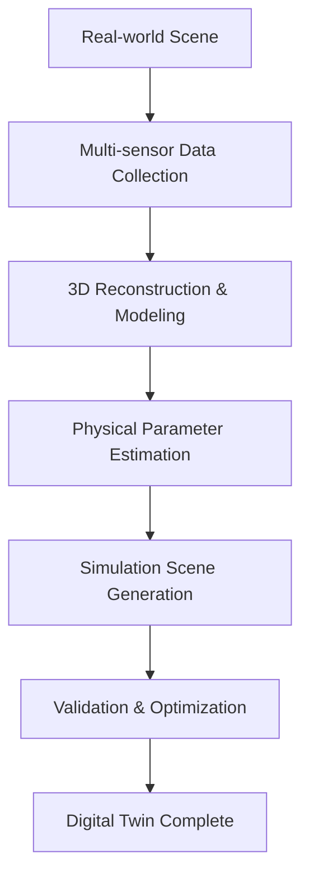
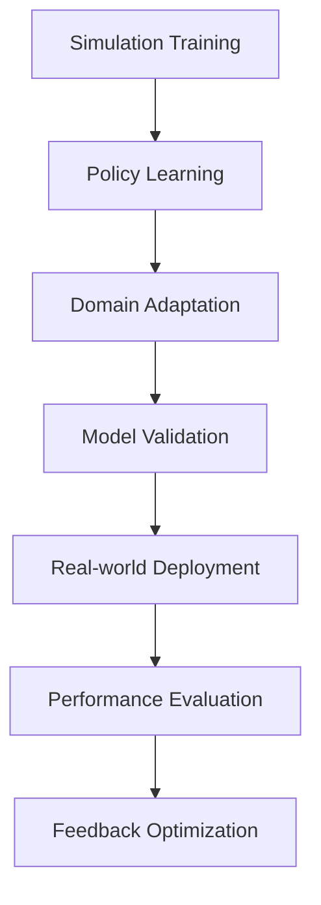

# Basic Concepts

This document introduces the core concepts and architecture of the DISCOVERSE framework, helping you understand this unified, modular 3DGS robot simulation platform in depth.

## What is DISCOVERSE?

DISCOVERSE (**Efficient Robot Simulation in Complex High-Fidelity Environments**) is an open-source robot simulation framework based on 3D Gaussian Splatting (3DGS), designed for the Real2Sim2Real learning workflow.

### Core Principles

- **Unified**: One framework supports multiple robots, sensors, and learning algorithms
- **Modular**: Flexible component design, supporting on-demand combination
- **High Fidelity**: Realistic visual simulation based on 3DGS
- **Practical**: Sim2Real transfer for real-world applications

## Key Features Explained

### 🎯 High-Fidelity Real2Sim Generation

The unique advantage of DISCOVERSE is its ability to generate high-fidelity digital twins from real-world scenes:

#### Layered Scene Reconstruction
- **Background Environment Reconstruction**: Use 3DGS technology to reconstruct static environments
- **Interactive Object Modeling**: Independently model operable objects
- **Physical Property Mapping**: Infer physical parameters from visual appearance

#### Advanced Sensor Integration
- **LiDAR Scanning**: Integrate LiDAR for precise geometry capture
- **Multi-view Cameras**: Support RGB, depth, infrared, and other modalities
- **IMU Data**: Include inertial measurement unit data

#### AI-driven 3D Generation
- **Neural Rendering**: Scene reconstruction based on NeRF and 3DGS
- **Generative Models**: Use state-of-the-art AI models to enhance scene diversity
- **Auto Annotation**: AI-assisted semantic segmentation and object recognition

### 🔧 Universal Compatibility & Flexibility

#### Multi-format Asset Support
```
Supported Model Formats:
├── 3DGS Models (.ply)      # High-fidelity rendering
├── Mesh Models (.obj/.stl) # Traditional geometric representation
├── MJCF Scenes (.xml)      # MuJoCo physics simulation
└── URDF Models (.urdf)     # ROS standard robot description
```

#### Diverse Robot Platforms
- **Robotic Arms**: Airbot Play, UR5, Franka Panda
- **Mobile Manipulators**: MMK2 dual-arm robot
- **Dexterous Hands**: LeapHand tactile hand
- **Mobile Robots**: Four-wheel, omnidirectional platforms
- **Quadrotors**: Drone platforms
- **Humanoid Robots**: Extended support

#### Multiple Sensor Modalities
- **Vision Sensors**: RGB, depth, stereo cameras
- **LiDAR**: 2D/3D LiDAR with GPU acceleration support
- **Inertial Sensors**: IMU, gyroscopes, accelerometers
- **Tactile Sensors**: Force sensors, tactile arrays
- **Specialized Sensors**: RealSense, Kinect, etc.

#### ROS2 Integration
- **Seamless Interface**: Native ROS2 communication support
- **Standard Messages**: Compatible with ROS standard message formats
- **Hardware Bridging**: Simplified Sim2Real deployment pipeline

### 🎓 End-to-End Learning Pipeline

#### Automated Data Collection
- **100x Efficiency Boost**: Compared to real-world data collection
- **Parallel Generation**: Support for multi-process parallel data generation
- **Format Standardization**: Compatible with mainstream learning algorithm data formats

#### Multiple Learning Algorithm Support
- **ACT** (Action Chunking with Transformers): Transformer-based action chunking
- **Diffusion Policy**: Diffusion model policy learning
- **RDT** (Robotics Diffusion Transformer): Robot-specific diffusion Transformer
- **Custom Algorithms**: Extensible algorithm interfaces

#### Zero-shot Sim2Real Transfer
- **State-of-the-art Performance**: Achieving industry-leading levels across multiple benchmarks
- **Domain Adaptation Techniques**: Built-in domain randomization and style transfer
- **Robustness Guarantees**: Considering real-world uncertainty and noise

## Data Flow Architecture

### Real2Sim Process



### Sim2Real Process



## Modular Design

### On-demand Installation
DISCOVERSE adopts a modular design, allowing users to install specific functionalities as needed:

```bash
# Basic functionality
pip install -e .

# LiDAR module
pip install -e ".[lidar]"

# High-fidelity rendering
pip install -e ".[gaussian-rendering]"

# Imitation learning algorithms
pip install -e ".[act_full]"
```

## Next Steps

Now that you understand the basic concepts of DISCOVERSE, you can:

1. **[Run Tutorials](../tutorials/basic-simulation/overview.md)** - Hands-on practice with basic simulation
2. **[Sensor Configuration](../tutorials/sensors/overview.md)** - Learn about sensor systems
3. **[Learning Algorithms](../tutorials/imitation-learning/overview.md)** - Explore machine learning applications
4. **[Advanced Features](../advanced/gaussian-splatting/overview.md)** - Dive into high-fidelity rendering

Understanding these core concepts will help you better use DISCOVERSE to build your own robot simulation applications!
