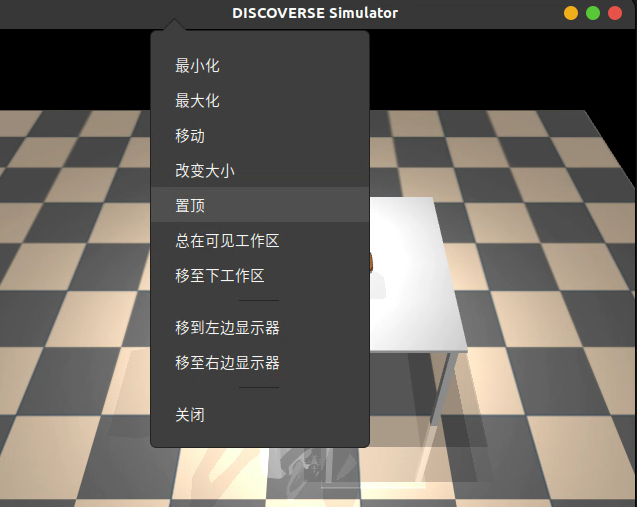

# Automated Data Generation

Compared to real-world scenarios, simulators have a significant advantage in easily obtaining privileged observations. For example, in simulation, you can directly access position, orientation, velocity, and other information of any object. Using this information, you can automatically generate atomic operation data. Below is an example using ROS1 gamepad control to generate operation strategies for the plate_coffee_cup task.

## Prerequisites

+ Simulator environment
+ ROS1 and a gamepad supporting ROS1

## Recording Operation Strategies

1. Set the task scene `cfg.mjcf_file_path` in `discoverse/examples/ros1/mmk2_joy_ros1.py`

2. Launch:

   ```bash
   (terminal 1)
   roscore
   (terminal 2)
   rosrun joy joy_node
   (terminal 3)
   python3 discoverse/examples/ros1/mmk2_joy_ros1.py
   ```

3. Right-click the title bar and set the display window to stay on top

   

4. Mouse and keyboard operations:

   + Left-click drag: Rotate view
   + Right-click drag: Pan view
   + Press scroll wheel and move mouse up/down: Change zoom
   + `[` and `]`: Switch camera views
   + `Esc`: Switch to free view
   + `Ctrl`+`D`: Toggle depth rendering
   + `p`: Print key information

5. Control using gamepad:

   + Left stick: Control chassis movement
   + Right stick: Control head movement
   + LT left trigger: Lift up
   + RT right trigger: Lift down
   + LB left shoulder button (hold continuously to control left arm):
     + D-pad up/down: End-effector translation along x-axis
     + D-pad left/right: End-effector translation along y-axis
     + Left stick up/down: End-effector translation along z-axis
     + Left stick left/right: End-effector rotation around z-axis
     + Right stick left/right: End-effector rotation around x-axis
     + Right stick up/down: End-effector rotation around y-axis
     + LT, RT: Control gripper open/close
   + RB right shoulder button (hold continuously to control right arm):
     + Same operation logic as LB. LB and RB can be pressed simultaneously

6. Record key points:

   (Note: The robot will not automatically avoid obstacles during movement. Consider using key points to separate horizontal and vertical movements into different motion phases)

   1. Use the gamepad to control the robot to key points, positioning as accurately as possible
   2. After reaching a key point, click on the simulator window with the mouse and press the `o` key
   3. The terminal will prompt to select the relative object (if picking up a cup, select the cup; after picking up the cup to place it in a plate, select the plate at this time), select and press Enter
   4. The terminal will prompt to select the arm to use: a (both arms) / l (left) / r (right), select and press Enter
   5. Set delay time in seconds, press Enter directly for no delay by default
   6. Repeat steps 1-5, complete the task and record all key points, then exit the simulator
   7. A `scheme_'task_name'.json` file will be generated in the `discoverse/examples/ros1` path

7. Test strategy `scheme_'task_name'.json`:

   ```bash
   python discoverse/examples/tasks_mmk2/gendata_from_json.py --task_name task_name --scheme_json /path/to/your/scheme_{task_name}.json --vis
   e.g.
   python discoverse/examples/tasks_mmk2/gendata_from_json.py --task_name plate_coffeecup --scheme_json /path/to/your/scheme_plate_coffeecup.json --vis
   ```
