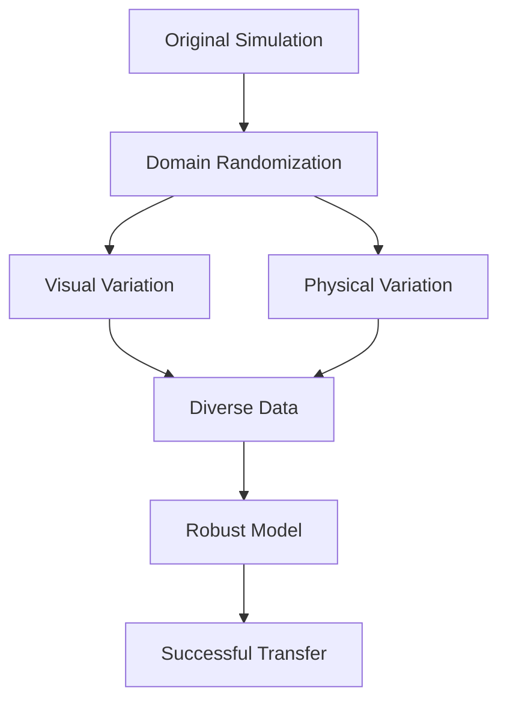

# Domain Randomization Techniques

## Overview

Domain Randomization is a core technology in DISCOVERSE, used to bridge the gap between simulation and reality. By introducing visual and physical variations during training, it improves model generalization and Sim2Real transfer.

## 🎯 Learning Objectives

- Understand the basic principles of domain randomization
- Master DISCOVERSE's visual domain randomization tools
- Learn to configure ComfyUI generative models
- Optimize Sim2Real transfer performance

## 💡 Core Principles

### What is Domain Randomization?

Domain randomization trains models in diverse simulated environments so they can adapt to real-world changes.

### Technical Advantages

1. **Bridges Sim2Real Gap** - Reduces the difference between simulation and reality
2. **Improves Generalization** - Enhances adaptability to environmental changes
3. **Lowers Development Cost** - Reduces reliance on high-fidelity simulation
