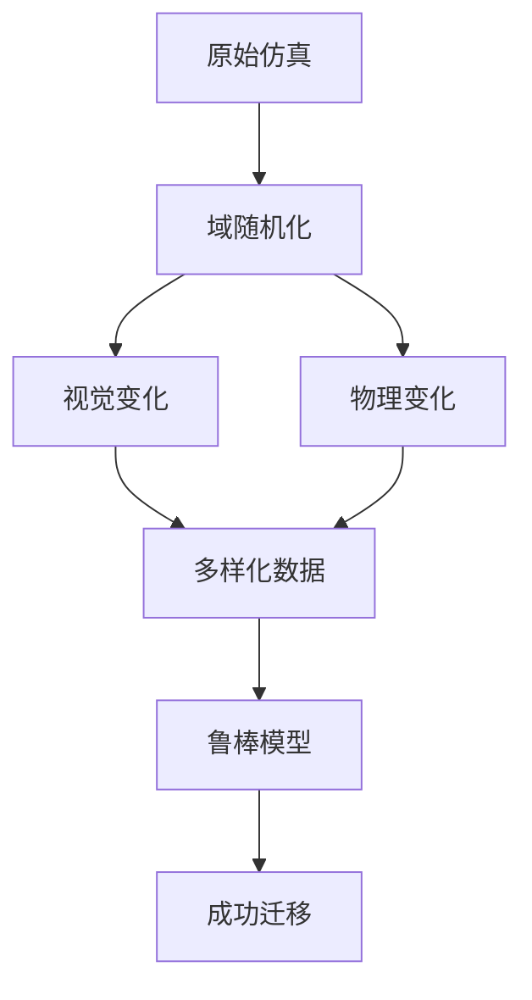

# 域随机化技术

## 概述

域随机化（Domain Randomization）是DISCOVERSE的核心技术，用于弥合仿真与现实之间的差距。通过在训练过程中引入视觉和物理变化，提升模型的泛化能力和Sim2Real迁移效果。

## 🎯 学习目标

- 理解域随机化的基本原理
- 掌握DISCOVERSE的视觉域随机化工具
- 学会配置ComfyUI生成模型
- 优化Sim2Real迁移效果

## 💡 核心原理

### 什么是域随机化？

域随机化通过在多样化的仿真环境中训练模型，使其能够适应现实世界的变化。



### 技术优势

1. **弥合Sim2Real差距** - 减少仿真与现实的差异
2. **提升泛化能力** - 增强对环境变化的适应性
3. **降低开发成本** - 减少对高保真仿真的依赖

## 🛠️ DISCOVERSE实现

### 系统架构

DISCOVERSE的域随机化工具位于`discoverse/randomain`目录：

- **数据采集** - `SampleforDR`类收集多模态数据
- **提示生成** - `augment.py`生成文本描述
- **场景变换** - `generate.py`执行视觉随机化

### 核心技术

#### 1. ComfyUI集成
- Stable Diffusion XL Turbo快速生成
- ControlNet深度条件保持几何一致性
- VAE编解码器优化性能

#### 2. 光流处理
- Farneback方法（轻量级）
- RAFT方法（高精度）
- 时序一致性保证

## 🚀 使用流程

### 步骤1：环境配置

```bash
# 安装ComfyUI
cd DISCOVERSE/submodules
git clone https://github.com/comfyanonymous/ComfyUI
cd ComfyUI && pip install -r requirements.txt

# 下载模型
# 下载sd_xl_turbo_1.0_fp16.safetensors到models/checkpoints/
# 下载controlnet_depth_sdxl_1.0.safetensors到models/controlnet/
# 下载sdxl_vae.safetensors到models/vae/
```

### 步骤2：数据采集

```python
from discoverse.randomain.utils import SampleforDR

# 配置采集参数
samples = SampleforDR(
    objs=['block_green', 'bowl_pink'],
    robot_parts=['panda_hand'],
    cam_ids=[0],
    save_dir="data/randomain/trajectory_000",
    fps=30
)

# 在仿真循环中采集
for step in simulation:
    samples.sampling(sim_node)

# 保存数据
samples.save()
```

### 步骤3：生成随机化场景

```bash
cd discoverse/randomain

python generate.py \
    --task_name block_place \
    --work_dir 000 \
    --cam_id 0 \
    --width 1280 \
    --height 768 \
    --num_steps 4 \
    --flow_interval 5
```

## 📊 效果评估

### 性能对比

| 方法 | 原始仿真 | DISCOVERSE DR |
|------|----------|---------------|
| 关闭笔记本 | 45% | **86%** |
| 推动鼠标 | 52% | **90%** |
| 拿起猕猴桃 | 38% | **76%** |

### 参数配置

| 参数 | 推荐值 | 说明 |
|------|--------|------|
| `--num_steps` | 4-8 | 扩散模型步数 |
| `--flow_interval` | 5-10 | 光流插值间隔 |
| `--width/height` | 1280x768 | 图像分辨率 |

## 🔧 高级功能

### 多场景随机化

```python
def multi_scene_randomization(scenarios):
    for scenario in scenarios:
        randomize_scene(
            work_dir=scenario['work_dir'],
            fore_objs=scenario['objects'],
            background_style=scenario['background']
        )

scenarios = [
    {'work_dir': '000', 'objects': ['cup'], 'background': '厨房'},
    {'work_dir': '001', 'objects': ['tool'], 'background': '工厂'}
]
```

### 自适应随机化

```python
class AdaptiveDR:
    def adapt_params(self, real_performance):
        if real_performance < 0.7:
            self.increase_randomization()
        elif real_performance > 0.9:
            self.reduce_randomization()
```

## 🛠️ 故障排除

### 常见问题

1. **ComfyUI连接失败**
   ```bash
   # 启动ComfyUI服务
   cd submodules/ComfyUI
   python main.py --listen --port 8188
   ```

2. **内存不足**
   ```bash
   # 降低分辨率
   --width 640 --height 480
   # 增加光流间隔
   --flow_interval 10
   ```

3. **生成质量差**
   ```bash
   # 增加扩散步数
   --num_steps 6
   # 优化提示词
   ```

## 下一步

- [模仿学习训练](../imitation-learning/overview) - 使用随机化数据训练
- [性能评估](../evaluation) - 验证Sim2Real效果
- [高级优化](../advanced) - 进一步提升性能

## 参考资源

- [Domain Randomization论文](https://arxiv.org/abs/1703.06907)
- [ComfyUI官方文档](https://github.com/comfyanonymous/ComfyUI)
- [RAFT光流论文](https://arxiv.org/abs/2003.12039) 