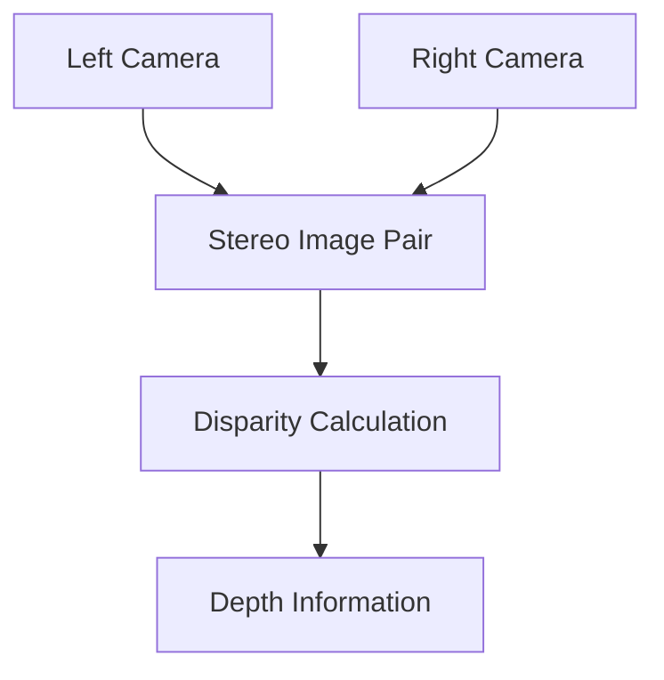

# Stereo Camera Simulation Details

## Overview

Stereo cameras are important components in robotic perception systems, acquiring depth information by simulating binocular vision. DISCOVERSE integrates powerful stereo camera simulation, supporting high-quality RGB and depth image rendering, as well as flexible camera trajectory planning.

## 🎯 Learning Objectives

After completing this tutorial, you will be able to:

- Understand the basic principles of stereo vision
- Master the use of the `camera_view.py` tool
- Configure binocular camera parameters
- Perform camera trajectory interpolation and data acquisition
- Parse observation data structures

## 📋 Prerequisites

- Complete the basic simulation tutorial
- Install 3D Gaussian rendering dependencies (optional, for high-fidelity rendering)
- Prepare 3DGS model files (.ply format)

## Principles of Stereo Vision

### What is a Stereo Camera?

A stereo camera system mimics human binocular vision and consists of two cameras placed side by side:

