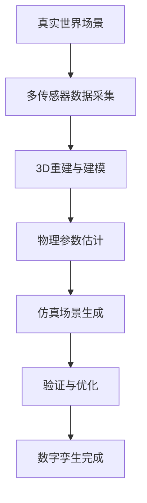
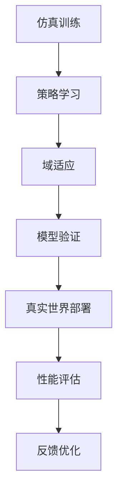

# 基本概念

本文档介绍DISCOVERSE框架的核心概念和架构设计，帮助您深入理解这个统一、模块化的3DGS机器人仿真平台。

## 什么是DISCOVERSE？

DISCOVERSE（**Efficient Robot Simulation in Complex High-Fidelity Environments**）是一个基于3D高斯散射（3DGS）的开源机器人仿真框架，专为Real2Sim2Real学习流程设计。

### 核心理念

- **统一性**: 一个框架支持多种机器人、传感器和学习算法
- **模块化**: 灵活的组件设计，支持按需组合
- **高保真**: 基于3DGS的逼真视觉仿真
- **实用性**: 面向真实世界应用的Sim2Real迁移

## 核心特性详解

### 🎯 高保真Real2Sim生成

DISCOVERSE的独特优势在于能够从真实世界场景生成高保真数字孪生：

#### 分层场景重建
- **背景环境重建**: 使用3DGS技术重建静态环境
- **交互物体建模**: 独立建模可操作的物体
- **物理属性映射**: 从视觉外观推断物理参数

#### 先进传感器集成
- **LiDAR扫描**: 集成激光雷达进行精确几何捕获
- **多视角相机**: 支持RGB、深度、红外等多种模态
- **IMU数据**: 包含惯性测量单元数据

#### AI驱动3D生成
- **神经渲染**: 基于NeRF和3DGS的场景重建
- **生成模型**: 使用最先进的AI模型增强场景多样性
- **自动标注**: AI辅助的语义分割和物体识别

### 🔧 通用兼容性与灵活性

#### 多格式资产支持
```
支持的模型格式:
├── 3DGS模型 (.ply)     # 高保真渲染
├── 网格模型 (.obj/.stl) # 传统几何表示
├── MJCF场景 (.xml)     # MuJoCo物理仿真
└── URDF模型 (.urdf)    # ROS标准机器人描述
```

#### 多样化机器人平台
- **机械臂**: Airbot Play、UR5、Franka Panda
- **移动操作臂**: MMK2双臂机器人
- **灵巧手**: LeapHand触觉手
- **移动机器人**: 四轮、全向轮平台
- **四旋翼**: 无人机平台
- **人形机器人**: 扩展支持

#### 多种传感器模态
- **视觉传感器**: RGB、深度、立体相机
- **激光雷达**: 2D/3D LiDAR，支持GPU加速
- **惯性传感器**: IMU、陀螺仪、加速度计
- **触觉传感器**: 力传感器、触觉阵列
- **专用传感器**: RealSense、Kinect等

#### ROS2集成
- **无缝接口**: 原生支持ROS2通信
- **标准消息**: 兼容ROS标准消息格式
- **硬件桥接**: 简化Sim2Real部署流程

### 🎓 端到端学习管道

#### 自动化数据收集
- **100倍效率提升**: 相比真实世界数据收集
- **并行生成**: 支持多进程并行数据生成
- **格式标准化**: 兼容主流学习算法的数据格式

#### 多种学习算法支持
- **ACT** (Action Chunking with Transformers): 基于Transformer的动作分块
- **Diffusion Policy**: 扩散模型策略学习
- **RDT** (Robotics Diffusion Transformer): 机器人专用扩散Transformer
- **自定义算法**: 可扩展的算法接口

#### 零样本Sim2Real迁移
- **最先进性能**: 在多个基准测试中达到业界领先水平
- **域适应技术**: 内置域随机化和风格迁移
- **鲁棒性保证**: 考虑真实世界的不确定性和噪声

## 数据流架构

### Real2Sim流程



### Sim2Real流程



## 模块化设计

### 按需安装
DISCOVERSE采用模块化设计，用户可以根据需要安装特定功能：

```bash
# 基础功能
pip install -e .

# 激光雷达模块
pip install -e ".[lidar]"

# 高保真渲染
pip install -e ".[gaussian-rendering]"

# 模仿学习算法
pip install -e ".[act_full]"
```

## 下一步学习

现在您已经了解了DISCOVERSE的基本概念，可以：

1. **[运行教程](../tutorials/basic-simulation/overview.md)** - 动手实践基础仿真
2. **[传感器配置](../tutorials/sensors/overview.md)** - 学习传感器系统
3. **[学习算法](../tutorials/imitation-learning/overview.md)** - 探索机器学习应用
4. **[高级功能](../advanced/gaussian-splatting/overview.md)** - 深入高保真渲染

理解这些核心概念将帮助您更好地使用DISCOVERSE构建自己的机器人仿真应用！ 