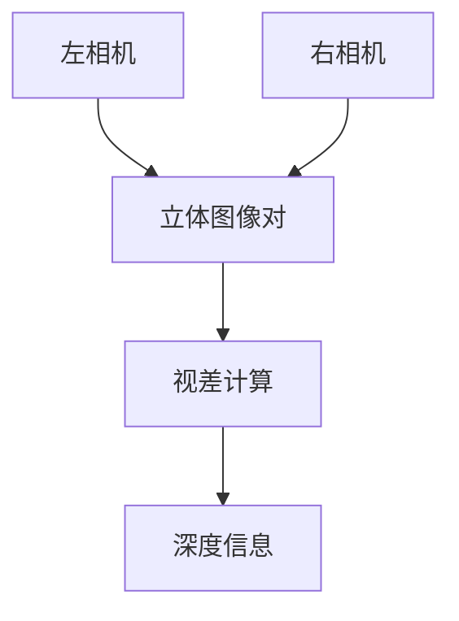

# 立体相机仿真详解

## 概述

立体相机是机器人感知系统中的重要组件，它通过模拟双眼视觉来获取深度信息。DISCOVERSE集成了强大的立体相机仿真功能，支持高质量的RGB和深度图像渲染，以及灵活的相机轨迹规划。

## 🎯 学习目标

完成本教程后，您将能够：

- 理解立体视觉的基本原理
- 掌握`camera_view.py`工具的使用
- 配置双目相机参数
- 执行相机轨迹插值和数据采集
- 解析观测数据结构

## 📋 前置要求

- 完成基础仿真教程
- 安装3D高斯渲染依赖（可选，用于高保真渲染）
- 准备3DGS模型文件（.ply格式）

## 立体视觉原理

### 什么是立体相机？

立体相机系统模仿人类双眼视觉，由两个并排放置的相机组成：



### 核心技术原理

1. **三角测量法**：通过两个相机的不同视角计算深度
2. **基线距离**：两相机间的距离，影响深度感知精度
3. **视差**：同一物体在左右图像中的位置差异

## 工具介绍：camera_view.py

`discoverse/examples/active_slam/camera_view.py` 是DISCOVERSE的核心立体相机工具，提供：

### 🔧 主要功能

- **实时双目渲染**：高质量RGB+深度图像
- **交互式相机控制**：键盘鼠标操作
- **相机轨迹规划**：关键帧保存与插值
- **数据批量导出**：支持大规模数据集生成

### 🎮 控制方式

#### 相机移动
- `W/S` - 前进/后退
- `A/D` - 左移/右移  
- `Q/E` - 上升/下降
- `Shift + 移动键` - 加速移动

#### 视角旋转
- `鼠标左键拖拽` - 旋转视角
- `ESC` - 切换自由相机模式
- `[/]` - 切换传感器相机

#### 功能快捷键
- `Space` - 保存当前相机位姿
- `I` - 导出相机位姿列表
- `Ctrl+G` - 切换高斯渲染
- `Ctrl+D` - 切换深度可视化

## 实际操作指南

### 1. 基础启动

```bash
# 启动交互模式
python discoverse/examples/active_slam/camera_view.py \
    --gsply /path/to/scene.ply \
    --show-gui

# 同时加载网格模型
python discoverse/examples/active_slam/camera_view.py \
    --gsply /path/to/scene.ply \
    --mesh /path/to/scene.obj \
    --show-gui
```

### 2. 参数配置

#### 相机参数
```bash
--camera-distance 0.06    # 基线距离（米）
--fovy 60.0              # 垂直视场角（度）
--width 1280             # 图像宽度
--height 720             # 图像高度
--max-depth 10.0         # 最大深度值
```

#### 完整示例
```bash
python discoverse/examples/active_slam/camera_view.py \
    --gsply models/3dgs/kitchen/kitchen.ply \
    --camera-distance 0.06 \
    --fovy 75.0 \
    --width 1920 \
    --height 1080 \
    --show-gui
```

### 3. 相机轨迹设计工作流

#### 阶段一：关键帧设计
1. **启动程序**（包含GUI）
2. **探索场景**：使用WASD键导航
3. **设置关键点**：在重要位置按`Space`保存
4. **管理视点**：在GUI中查看和编辑已保存位姿
5. **导出数据**：按`I`键保存为`camera_list.json`

#### 阶段二：轨迹插值与数据采集
```bash
python discoverse/examples/active_slam/camera_view.py \
    --gsply /path/to/scene.ply \
    --camera-pose-path camera_list.json \
    --num-interpolate 100
```

### 4. 插值算法详解

DISCOVERSE使用先进的插值技术确保相机运动的平滑性：

- **位置插值**：三次样条插值（Cubic Spline）
- **旋转插值**：球面线性插值（SLERP）

```python
# 插值结果自动保存到
interpolate_viewpoints/
├── rgb_img_0_0.png      # 左相机RGB图像
├── rgb_img_1_0.png      # 右相机RGB图像  
├── depth_img_0_0.npy    # 左相机深度数据
├── depth_img_1_0.npy    # 右相机深度数据
├── camera_poses_cam1.json # 左相机外参
└── camera_poses_cam2.json # 右相机外参
```

## 观测数据解析

### 数据结构详解

通过`robot.getObservation()`获取的观测数据：

```python
obs = {
    'rgb_cam_posi': [              # RGB相机位姿列表
        (position, quaternion),     # 每个相机的6DOF位姿
        ...
    ],
    'depth_cam_posi': [...],       # 深度相机位姿列表
    'rgb_img': {                   # RGB图像字典
        0: numpy_array,            # 左相机图像 (H,W,3)
        1: numpy_array,            # 右相机图像 (H,W,3)
    },
    'depth_img': {                 # 深度图像字典
        0: numpy_array,            # 左相机深度 (H,W)
        1: numpy_array,            # 右相机深度 (H,W)
    }
}
```

### 坐标系定义

DISCOVERSE使用统一的相机坐标系：
- **Z轴**：指向相机前方（视线方向）
- **Y轴**：指向相机下方
- **X轴**：指向相机右方

### 代码示例

```python
import numpy as np
from discoverse.envs.simulator import Simulator

# 初始化仿真器
sim = Simulator(mjcf_path="models/mjcf/camera_env.xml")

# 获取观测
obs = sim.getObservation()

# 访问立体图像
left_rgb = obs['rgb_img'][0]      # 左相机RGB
right_rgb = obs['rgb_img'][1]     # 右相机RGB
left_depth = obs['depth_img'][0]  # 左相机深度

# 获取相机位姿
left_pos, left_quat = obs['rgb_cam_posi'][0]
print(f"左相机位置: {left_pos}")
print(f"左相机姿态: {left_quat}")

# 计算视差图（简化示例）
def compute_disparity(left, right):
    """计算视差图的简化示例"""
    # 实际应用中需要使用立体匹配算法
    disparity = np.abs(left.astype(float) - right.astype(float))
    return disparity.mean(axis=2)  # 转为灰度

disparity = compute_disparity(left_rgb, right_rgb)
```
